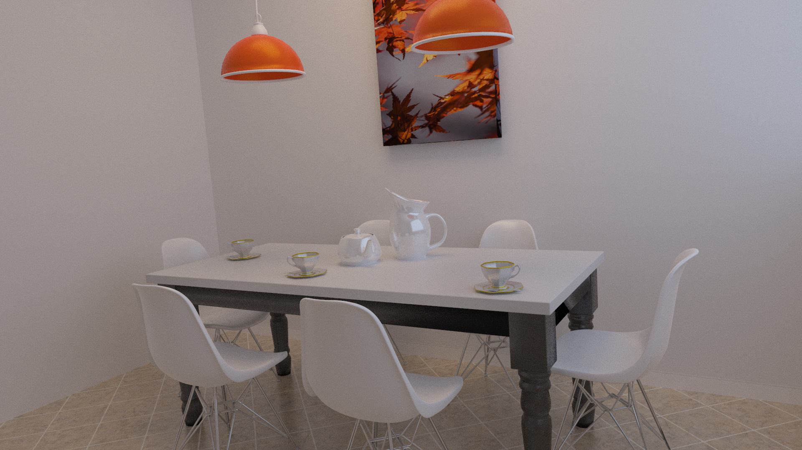
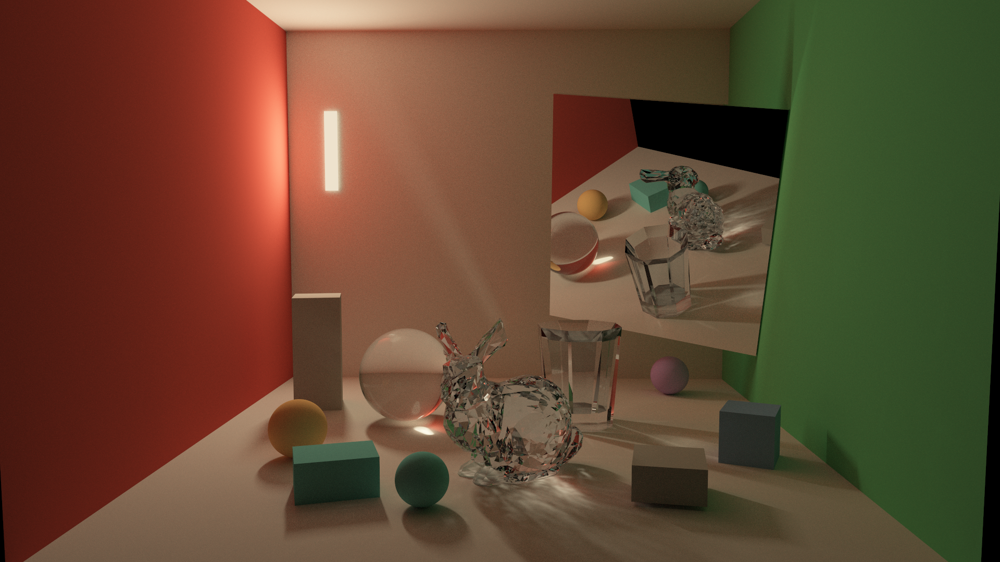
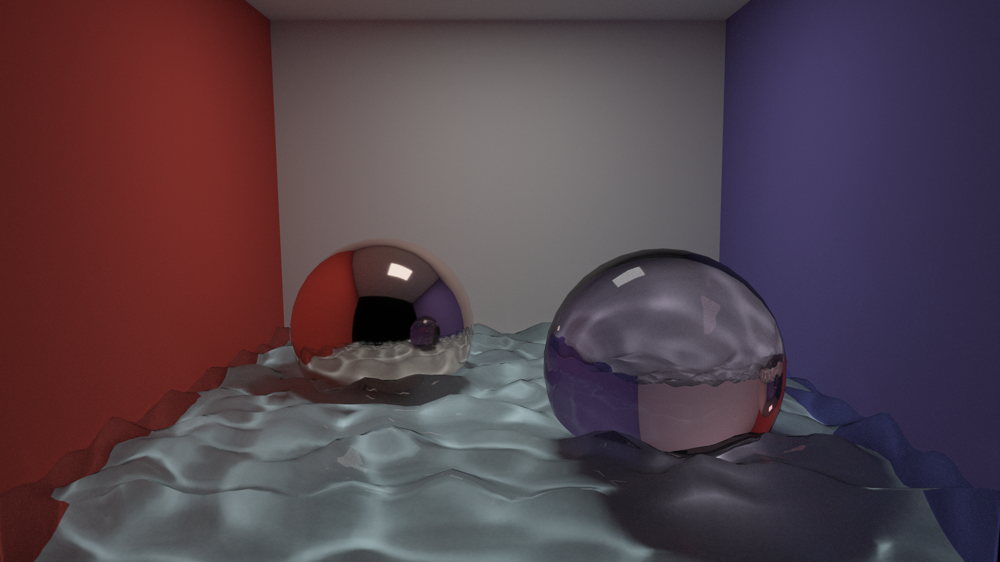

# RayTracer

THU 计算机图形学基础 2026 年春课程大作业。

本项目实现了一个基于 C++17 的离线光线追踪渲染器，支持 Path Tracing、BDPT、VCM、简单 Path Guiding、OBJ/MTL 网格加载、BVH 加速、纹理、玻璃/镜面/漫反射/自发光材质、面积光、OpenMP 并行渲染、色调映射，以及可选 SDL2 实时预览。

## 成品图







## 目录结构

- `code/`: 渲染器源码和 CMake 工程。
- `scenes/`: 场景描述文件，均为 `.txt`。
- `mesh/`: OBJ/MTL 模型和纹理资源。
- `report/`: 报告与最终展示图。
- `output/`: 推荐的渲染输出目录。

## 构建方法

依赖：

- CMake >= 3.10
- 支持 C++17 的编译器
- OpenMP
- SDL2 可选，仅用于 `--preview` 实时预览窗口

从仓库根目录构建：

```bash
cmake -S code -B build -DCMAKE_BUILD_TYPE=Release
cmake --build build -j
```

如果没有安装 SDL2，CMake 会自动关闭预览支持；也可以显式关闭：

```bash
cmake -S code -B build -DCMAKE_BUILD_TYPE=Release -DRAYTRACER_ENABLE_PREVIEW=OFF
cmake --build build -j
```

构建完成后的可执行文件为：

```bash
./build/RayTracer
```

## 使用方法

请在仓库根目录运行程序，因为场景文件里的模型路径通常写成 `mesh/...` 的相对路径。

基本格式：

```bash
./build/RayTracer <scene.txt> <output.bmp> [options]
```

示例：

```bash
./build/RayTracer scenes/scene05.txt output/scene05_vcm.bmp -vcm -n 256 -e 1.5
./build/RayTracer scenes/scene07.txt output/scene07_bdpt.bmp -bdpt -n 128 -e 1.5
./build/RayTracer scenes/scene04.txt output/scene04_pt_pg.bmp -pt -n 256 --path-guiding
```

输出文件由 `SaveBMP` 写出，建议使用 `.bmp` 后缀。

常用参数：

| 参数 | 说明 | 默认值 |
| --- | --- | --- |
| `-pt` | 使用 Path Tracing | 默认 |
| `-bdpt` | 使用 Bidirectional Path Tracing | - |
| `-vcm` | 使用 Vertex Connection and Merging | - |
| `-n <spp>` | 每像素采样数 | `32` |
| `-e <exposure>` | 曝光系数 | `1.5` |
| `-t <duration>` | 按时间限制渲染，例如 `30s`、`2m`、`1.5h` | 关闭 |
| `--sample-clamp <luminance>` | 限制单样本亮度，`0` 表示不限制 | `0` |
| `--preview` | 打开实时预览窗口，需要 SDL2 | 关闭 |
| `--preview-every <n>` | 每隔 n 轮采样刷新预览 | `1` |
| `--path-guiding` | 为 PT 启用路径引导 | 关闭 |
| `--pg-s0 <n>` | Path Guiding 开始启用的迭代数 | `32` |
| `--pg-s1 <n>` | Path Guiding 过渡到最大概率的迭代数 | `96` |
| `--pg-pmax <p>` | Path Guiding 最大采样概率，范围 `[0, 1]` | `0.5` |
| `--pg-grid <n>` | Path Guiding 空间网格分辨率，实际为 `n^3` | `8` |
| `--pg-map <n>` | Path Guiding 方向图分辨率，实际为 `n x n` | `32` |
| `--pg-forget <f>` | Path Guiding 历史遗忘因子，范围 `[0, 1]` | `0.98` |
| `--vcm-radius <r>` | VCM 初始合并半径 | `0.01` |
| `--vcm-camera-depth <n>` | VCM 相机路径最大深度 | `8` |
| `--vcm-light-depth <n>` | VCM 光源路径最大深度 | `5` |
| `--vcm-light-paths <n>` | VCM 每轮光源路径数，`0` 为自动 | `0` |
| `--vcm-caustic-only` | VCM 只合并焦散路径 | 默认 |
| `--vcm-all-merging` | VCM 对所有可合并路径做 merging | - |
| `-bdpt-direct <n>` | 设置 BDPT primary/secondary 直接光采样数 | `1` |
| `-bdpt-direct-primary <n>` | 设置 primary 直接光采样数 | `1` |
| `-bdpt-direct-secondary <n>` | 设置 secondary 直接光采样数 | `1` |

## Scene txt 语法

场景文件是空白分隔的 token 流，扩展名必须是 `.txt`。解析器目前不支持注释语法，因此不要在文件里写 `#` 或 `//` 注释。顶层支持以下块：

```txt
PerspectiveCamera { ... }
Lights { ... }
Background { ... }
Materials { ... }
Group { ... }
```

### 相机

```txt
PerspectiveCamera {
    center 0 0.78 2.48
    direction 0 -0.10 -1
    up 0 1 0
    angle 40
    width 1920
    height 1080
}
```

- `center`: 相机位置。
- `direction`: 视线方向。
- `up`: 相机上方向。
- `angle`: 垂直视场角，单位为度。
- `width`、`height`: 输出分辨率。

### 背景

```txt
Background {
    color 0.0 0.0 0.0
}
```

`color` 为 RGB 浮点颜色。

### 光源

显式光源支持方向光和点光：

```txt
Lights {
    numLights 2
    DirectionalLight {
        direction 0 -1 0
        color 1 1 1
    }
    PointLight {
        position 0 1 0
        color 10 10 10
    }
}
```

实际场景中更常用面积光：给 `Triangle` 或 `TriangleMesh` 使用带 `emission` 的材质，解析器会自动把发光三角形加入面积光采样列表。因此很多场景可以写：

```txt
Lights {
    numLights 0
}
```

### 材质

材质块先声明数量，再依次定义材质：

```txt
Materials {
    numMaterials 3
    Material {
        diffuseColor 0.78 0.76 0.70
        specularColor 0 0 0
        shininess 10
    }
    MirrorMaterial {
        mirrorColor 0.92 0.92 0.90
        roughness 0.0005
    }
    GlassMaterial {
        diffuseColor 0 0 0
        specularColor 1 1 1
        transmissionColor 0.96 0.99 1.0
        ior 1.5
    }
}
```

支持的材质块名：

- `Material` / `PhongMaterial`: 默认漫反射/Phong 材质。
- `MirrorMaterial`: 镜面材质。
- `GlassMaterial`: 玻璃材质。

支持的字段：

- `diffuseColor r g b`: 漫反射颜色。
- `specularColor r g b`: 高光颜色。
- `mirrorColor r g b` / `reflectance` / `reflectionColor`: 镜面反射颜色。
- `transmissionColor r g b` / `transmittance`: 透射颜色。
- `ior` / `refractiveIndex`: 折射率。
- `shininess value`: Phong 高光指数。
- `roughness value`: 粗糙度。
- `emission r g b` / `emissionColor`: 自发光颜色；非零时材质会被视为发光材质。
- `texture path`: 漫反射纹理路径。
- `type name` / `materialType name`: 可选类型覆盖，`name` 可为 `diffuse`、`phong`、`mirror`、`emissive`、`glass`。

OBJ 自带的 MTL 也会被读取：若 OBJ 面指定了 MTL 材质，会优先使用 MTL 中的漫反射、镜面、发光、透明度、IOR 和漫反射贴图等信息。

### 物体组

```txt
Group {
    numObjects 2
    MaterialIndex 0
    Sphere {
        center 0 0.5 0
        radius 0.5
    }
    MaterialIndex 1
    TriangleMesh {
        obj_file mesh/cube.obj
    }
}
```

- `numObjects` 只统计真正的物体数量，不统计 `MaterialIndex`。
- `MaterialIndex i` 会切换当前材质，之后的物体使用该材质，直到下一个 `MaterialIndex`。

支持的物体：

```txt
Sphere {
    center x y z
    radius r
}

Plane {
    normal x y z
    offset d
}

Triangle {
    vertex0 x y z
    vertex1 x y z
    vertex2 x y z
}

TriangleMesh {
    obj_file mesh/model.obj
}
```

### 变换

`Transform` 内可以先写若干变换，再写一个物体或嵌套 `Group`：

```txt
Transform {
    Translate 0.2 0.0 -0.3
    YRotate 25
    UniformScale 1.5
    TriangleMesh {
        obj_file mesh/bunny_1k.obj
    }
}
```

支持的变换：

- `Translate x y z`
- `Scale x y z`
- `UniformScale s`
- `XRotate degrees`
- `YRotate degrees`
- `ZRotate degrees`
- `Rotate { axis_x axis_y axis_z degrees }`
- `Matrix4f { ...16 个浮点数... }`

## 最小场景模板

```txt
PerspectiveCamera {
    center 0 0.6 2.3
    direction 0 -0.05 -1
    up 0 1 0
    angle 38
    width 1280
    height 720
}

Lights {
    numLights 0
}

Background {
    color 0 0 0
}

Materials {
    numMaterials 2
    Material {
        diffuseColor 0.78 0.76 0.70
        specularColor 0 0 0
        shininess 10
    }
    Material {
        diffuseColor 1 0.86 0.65
        emission 40 32 24
    }
}

Group {
    numObjects 2
    MaterialIndex 0
    Sphere {
        center 0 0.35 0
        radius 0.35
    }
    MaterialIndex 1
    Triangle {
        vertex0 -0.5 1.0 -0.5
        vertex1 0.5 1.0 -0.5
        vertex2 0.0 1.0 0.5
    }
}
```
